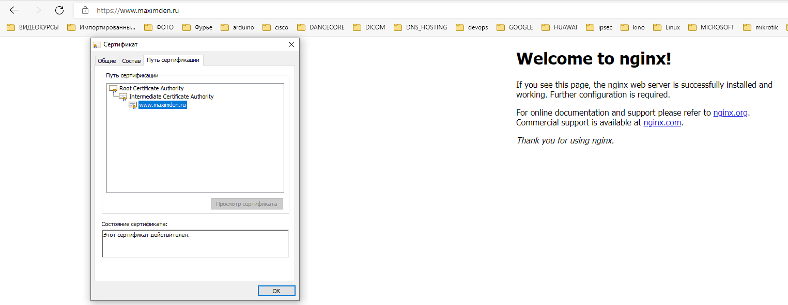

Виртуальная машина №1
=====================
- Разворачиваем виртуалку при помощи Vagrant (UBUNTU-20.04)
```commandline
Vagrant.configure("2") do |config|
  config.vm.box = "bento/ubuntu-20.04"
  config.vm.network "forwarded_port", guest: 80, host: 80
  config.vm.network "forwarded_port", guest: 8200, host: 8200
  config.vm.network "forwarded_port", guest: 443, host: 443
  config.vm.network "private_network", ip: "192.168.33.10"

  config.vm.provider "virtualbox" do |vb|
     vb.memory = "2096"
  end
end
```
---
- Настраиваем фаервол ufw
```
ufw default deny incoming
ufw default allow outgoing
ufw allow OpenSSH
ufw allow in 443/tcp
ufw allow in 8200/tcp
ufw allow from 127.0.0.1 to any
ufw enable
```
---
- Установка допольнительных пакетов которые понадобятся
```
apt-get install jq
apt-get install wget chrony curl apt-transport-https
```
---
- Настройка времени
```
timedatectl set-timezone Europe/Moscow
systemctl enable chrony
systemctl restart chrony
```
---
- Установка Vault
```
curl -fsSL https://apt.releases.hashicorp.com/gpg | sudo apt-key add -
sudo apt-add-repository "deb [arch=amd64] https://apt.releases.hashicorp.com $(lsb_release -cs) main"
sudo apt-get update && sudo apt-get install vault
```
Редактируем настройки Vault на работу по http:
```
nano /etc/vault.d/vault.hcl
listener "tcp" {
  address = "127.0.0.1:8201"
  tls_disable = 1
}
```
Запускаем как службу

`systemctl enable vault --now`

Экспортируем настройки для работы

`export VAULT_ADDR=http://127.0.0.1:8201`

Инициализируем и получаем коды для разблокировки и токер root:

`vault operator init`
```
Unseal Key 1: whmvItbMxIuvltsjl/8zgj9YxMmbjgECyGTQV2pxzmLc
Unseal Key 2: E7VaYcIvh2FN7lMv++YYcQKwt9hrhPRjVWV2p1y44Hb1
Unseal Key 3: mdstSx/YTeo3p6s7wqEzexS2W6VXTyNh2TgIltv5fm3i
Unseal Key 4: Z/2EV93SjtZ++WtgD3B/djOEGz2xxgfCXBQCrL9l7E9E
Unseal Key 5: n3MtFg5jFxKPc4PWGxCIqIVvite2ACYnCrDhbit3+ebK

Initial Root Token: hvs.hw4BrcrmL6sFIvnaTRhLHUg8
```
Создаем скрипт для разброкировки хранилища при загрузке (не безопасно, но удобно):
```
mkdir /scripts
nano /scripts/unseal.sh
```
```
#!/bin/bash
PATH=/etc:/bin:/sbin:/usr/bin:/usr/sbin:СО/usr/local/bin:/usr/local/sbin

sleep 10
vault operator unseal whmvItbMxIuvltsjl/8zgj9YxMmbjgECyGTQV2pxzmLc
vault operator unseal E7VaYcIvh2FN7lMv++YYcQKwt9hrhPRjVWV2p1y44Hb1
vault operator unseal mdstSx/YTeo3p6s7wqEzexS2W6VXTyNh2TgIltv5fm3i
```


Разрешаем выполнение

`chmod +x /scripts/unseal.sh`

Создаем юнит:

`nano /etc/systemd/system/vault-unseal.service`

```
[Unit]
Description=Vault Auto Unseal Service
After=network.target
After=vault.service

[Service]
Environment="VAULT_ADDR=http://127.0.0.1:8201"
ExecStart=/scripts/unseal.sh
Type=oneshot
RemainAfterExit=no

[Install]
WantedBy=multi-user.target
```


Перечитаем конфигурацию для systemd:
```
systemctl daemon-reload
```
Разрешаем автозапуск созданного сервиса:
```
systemctl enable vault-unseal
```
---
- Настройка pki и генерация корневых сертификатов  

Авторизуемся по команде `vault login` или экспортируем в переменную окружения:  

`export VAULT_TOKEN=hvs.hw4BrcrmL6sFIvnaTRhLHUg8`

Включаем работу с сертификатами и создаем корневой сертификат, промежуточный, и сертификат сервера.

Запускаем скрипт, поправив в нем нужные данные:  
`init_and_get_cert.sh`
```
#!/bin/bash

# 720h = 30 дней
# 8760h = 1 год
# 43800h = 5 лет
# cert: 87600h = 10 лет
# int: 175200h = 20 лет
# root: 262800h = 30 лет

site_name="vault.maximden.ru"
dir_name="maximden-dot-ru"
country="Russian Federation"
locality="Moscow"
postal_code="424000"
allowed_domains="maximden.ru"
ca_street="Lenina 1"
ca_org="Max Den Lab1"
ca_ou="IT"
ca_url="https://$site_name"


# enable Vault PKI secret
vault secrets enable \
  -path=pki_root_ca \
  -description="PKI Root CA" \
  -max-lease-ttl="262800h" \
  pki

# generate root CA
vault write -format=json pki_root_ca/root/generate/internal \
  common_name="Root Certificate Authority" \
  country="$country" \
  locality="$locality" \
  street_address="$ca_street" \
  postal_code="$postal_code" \
  organization="$ca_org" \
  ou="$ca_ou" \
  ttl="262800h" > pki-root-ca.json

# save the certificate
cat pki-root-ca.json | jq -r .data.certificate > rootCA.pem

# publish urls for the root ca
vault write pki_root_ca/config/urls \
  issuing_certificates="$ca_url/v1/pki_root_ca/ca" \
  crl_distribution_points="$ca_url/v1/pki_root_ca/crl"

# enable Vault PKI secret
vault secrets enable \
  -path=pki_int_ca \
  -description="PKI Intermediate CA" \
  -max-lease-ttl="175200h" \
  pki

# create intermediate CA with common name example.com and save the CSR
vault write -format=json pki_int_ca/intermediate/generate/internal \
  common_name="Intermediate Certificate Authority" \
  country="$country" \
  locality="$locality" \
  street_address="$ca_street" \
  postal_code="$postal_code" \
  organization="$ca_org" \
  ou="$ca_ou" \
  ttl="175200h" | jq -r '.data.csr' > pki_intermediate_ca.csr

# send the intermediate CA's CSR to the root CA
vault write -format=json pki_root_ca/root/sign-intermediate csr=@pki_intermediate_ca.csr \
  country="$country" \
  locality="$locality" \
  street_address="$ca_street" \
  postal_code="$postal_code" \
  organization="$ca_org" \
  ou="$ca_ou" \
  format=pem_bundle \
  ttl="175200h" | jq -r '.data.certificate' > intermediateCA.cert.pem

# publish the signed certificate back to the Intermediate CA
vault write pki_int_ca/intermediate/set-signed \
  certificate=@intermediateCA.cert.pem

# publish the intermediate CA urls ???
vault write pki_int_ca/config/urls \
  issuing_certificates="$ca_url/v1/pki_int_ca/ca" \
  crl_distribution_points="$ca_url/v1/pki_int_ca/crl"

# create a role $dir_name-server
vault write pki_int_ca/roles/$dir_name-server \
  country="$country" \
  locality="$locality" \
  street_address="$ca_street" \
  postal_code="$postal_code" \
  organization="$ca_org" \
  ou="$ca_ou" \
  allowed_domains="$allowed_domains" \
  allow_subdomains=true \
  max_ttl="87600h" \
  key_bits="2048" \
  key_type="rsa" \
  allow_any_name=false \
  allow_bare_domains=false \
  allow_glob_domain=false \
  allow_ip_sans=true \
  allow_localhost=false \
  client_flag=false \
  server_flag=true \
  enforce_hostnames=true \
  key_usage="DigitalSignature,KeyEncipherment" \
  ext_key_usage="ServerAuth" \
  require_cn=true

# create a role $dir_name-client
vault write pki_int_ca/roles/$dir_name-client \
  country="$country" \
  locality="$locality" \
  street_address="$ca_street" \
  postal_code="$postal_code" \
  organization="$ca_org" \
  ou="$ca_ou" \
  allow_subdomains=true \
  max_ttl="87600h" \
  key_bits="2048" \
  key_type="rsa" \
  allow_any_name=true \
  allow_bare_domains=false \
  allow_glob_domain=false \
  allow_ip_sans=false \
  allow_localhost=false \
  client_flag=true \
  server_flag=false \
  enforce_hostnames=false \
  key_usage="DigitalSignature" \
  ext_key_usage="ClientAuth" \
  require_cn=true

# Create cert, 5 years
vault write -format=json pki_int_ca/issue/$dir_name-server \
  common_name="$site_name" \
  alt_names="$site_name" \
  ttl="43800h" > $site_name.crt

# save cert
cat $site_name.crt | jq -r .data.certificate > $site_name.crt.pem
cat $site_name.crt | jq -r .data.issuing_ca >> $site_name.crt.pem
cat $site_name.crt | jq -r .data.private_key > $site_name.crt.key
```
В Linux добавляем корневой сертификат в доверенные
```
cp rootCA.pem /usr/local/share/ca-certificates/rootCA.crt
cp intermediateCA.cert.pem /usr/local/share/ca-certificates/intermediateCA.crt
```
обновляем 
```
update-ca-certificates
```
копируем сгенерированные сертификаты для использования Vault
```
cp vault.maximden.ru.crt.pem /opt/vault/tls/tls.crt
cp vault.maximden.ru.crt.key /opt/vault/tls/tls.key
```
правим конфиг Vault:  
`nano /etc/vault.d/vault.hcl`
```
listener "tcp" {
  address       = "0.0.0.0:8200"
  tls_cert_file = "/opt/vault/tls/tls.crt"
  tls_key_file  = "/opt/vault/tls/tls.key"
}

```
рестартим Vault:
`systemctl restart vault`

Прописываем в hosts

`echo "127.0.0.1 vault.maximden.ru" >> /etc/hosts`

Правим скрипт разблокировки Vault:

nano /etc/systemd/system/vault-unseal.service
```
[Unit]
Description=Vault Auto Unseal Service
After=network.target
After=vault.service

[Service]
Environment="VAULT_ADDR=https://vault.maximden.ru:8200"
ExecStart=/scripts/unseal.sh
Type=oneshot
RemainAfterExit=no

[Install]
WantedBy=multi-user.target
```
При условии что корневой сертификат добавлен в доверенные на хостовой машине и имя прописано в hosts соединение будет без ошибок сертификата.


Теперь для работы с Vault необходимо использовать другой путь через доманное имя.  
`export VAULT_ADDR=https://vault.maximden.ru:8200`

Создаем политику для работы с сертификатами домена maximden.ru
```commandline
vault policy write www-maximden-ru-server-policy - << EOF
path "pki_int_ca/issue/maximden-dot-ru-server" {
  capabilities = ["read", "create", "update"]
}
EOF
```
Создаем пользователя и назначаем на него политику:

`vault token create -policy=www-maximden-ru-server-policy`
```commandline
root@vagrantvm1:/scripts# vault token create -policy=www-maximden-ru-server-policy
Key                  Value
---                  -----
token                hvs.CAESIGi39_9OAAedZcqbrSiGf08EK8yHdF1E1LQ-EAq5meKvGh4KHGh2cy5EMFdTZUZ4cGFMMktLYkMzTHpkcDdQVGM
token_accessor       IfxRsDsk2y0Aj6rnXnzaMKc8
token_duration       768h
token_renewable      true
token_policies       ["default" "www-maximden-ru-server-policy"]
identity_policies    []
policies             ["default" "www-maximden-ru-server-policy"]
```
Логинимся под созданным пользователем:  
 `vault login`

Генерируем сертификат для сайта www.maximden.ru
```
#!/bin/bash

# 720h = 30 дней
# 8760h = 1 год
# 43800h = 5 лет
# cert: 87600h = 10 лет
# int: 175200h = 20 лет
# root: 262800h = 30 лет

site_name="www.maximden.ru"
dir_name="maximden-dot-ru"

# Create cert, 1 month
vault write -format=json pki_int_ca/issue/$dir_name-server \
  common_name="$site_name" \
  alt_names="$site_name" \
  ttl="7200h" > $site_name.crt

# save cert
cat $site_name.crt | jq -r .data.certificate > $site_name.crt.pem
cat $site_name.crt | jq -r .data.issuing_ca >> $site_name.crt.pem
cat $site_name.crt | jq -r .data.private_key > $site_name.crt.key
```
В папке сгенерируются 3 файла:  
```
www.maximden.ru.crt
www.maximden.ru.crt.key
www.maximden.ru.crt.pem
```
---
Установка nginx

apt install nginx

Редактируем конфиг:  
`nano /etc/nginx/sites-available/default`

В секции servers
```
server {

        listen 443 ssl default_server;
        listen [::]:443 ssl default_server;


        root /var/www/html;

        index index.html index.htm index.nginx-debian.html;

        server_name www.maximden.ru;
        ssl_certificate     /scripts/www/www.maximden.ru.crt.pem;
        ssl_certificate_key /scripts/www/www.maximden.ru.crt.key;
        ssl_protocols       TLSv1 TLSv1.1 TLSv1.2;
        ssl_ciphers         HIGH:!aNULL:!MD5;

        location / {
                try_files $uri $uri/ =404;
        }

}
```
Перезапускаем nginx:  
`systemctl restart nginx`

Заходим на адрес предварительно прописав его в hosts:  

---
Виртуальная машина №2
=======================
_*Генерация и обновление сертификата сайта.*_

Создаем вторую виртуальную машину.  
```commandline
Vagrant.configure("2") do |config|

  config.vm.box = "bento/ubuntu-20.04"
  config.vm.network "forwarded_port", guest: 80, host: 81
  config.vm.network "forwarded_port", guest: 8200, host: 8201
  config.vm.network "forwarded_port", guest: 443, host: 444
  config.vm.network "private_network", ip: "192.168.33.11"

  config.vm.provider "virtualbox" do |vb|
     vb.memory = "2096"
  end
end
```
Устанавливаем vault для использования его как клиента подключения из консоли.  
Устанавливаем nginx.  
Добавляем наш корневой и промежуточный сертификаты в доверенные.  
Добавляем в hosts имя и адрес по которому находиться первая машина с vault.  
Создаем папку /www_cert в ней будет находиться скрипт обновления и сгенерированные сертификаты.  

Скритп создания нового сертификата:  
```commandline
#!/bin/bash

site_name="www.maximden.ru"
dir_name="maximden-dot-ru"
export VAULT_ADDR=https://vault.maximden.ru:8200
export VAULT_TOKEN=hvs.CAESIGi39_9OAAedZcqbrSiGf08EK8yHdF1E1LQ-EAq5meKvGh4KHGh2cy5EMFdTZUZ4cGFMMktLYkMzTHpkcDdQVGM

# Create cert, 1 hour
vault write -format=json pki_int_ca/issue/$dir_name-server \
  common_name="$site_name" \
  alt_names="$site_name" \
  ttl="1h" > $site_name.crt

# save cert
cat $site_name.crt | jq -r .data.certificate > cert.pem
cat $site_name.crt | jq -r .data.issuing_ca >> cert.pem
cat $site_name.crt | jq -r .data.private_key > cert.key
log="Script: renew_cer.sh generate a certificatecate: "
log+="$( cat $site_name.crt | jq -r .data.serial_number)"
logger $log
rm $site_name.crt
unset VAULT_ADDR VAULT_TOKEN site_name dir_name log

systemctl restart nginx
```
Изменяем настройки nginx для работы сайта по https и указываем путь где будет находиться сгенерированный сертификат.
```commandline
        server_name www.maximden.ru;
        ssl_certificate     /www_cert/cert.pem;
        ssl_certificate_key /www_cert/cert.key;
        ssl_protocols       TLSv1 TLSv1.1 TLSv1.2;
        ssl_ciphers         HIGH:!aNULL:!MD5;
```
Создаем расписание в cron для периодического обновления сертификата. Каждую минуту для наглядности.
```
*/1 * * * * /www_cert/renew_cert.sh
```
Результат работы на скрине:  


Сайт при открытии с хостовой машины выглядит следующим образом:  

