# Домашнее задание к занятию "3.1. Работа в терминале, лекция 1" Максимов Денис

1. *Установите средство виртуализации Oracle VirtualBox.*
---
Рисунок 1  
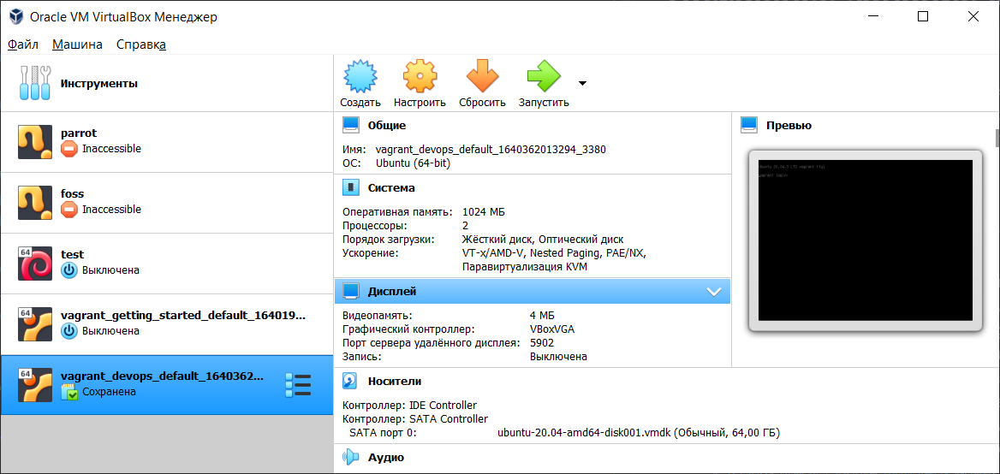
---

2. *Установите средство автоматизации Hashicorp Vagrant.*
---
Рисунок 2  
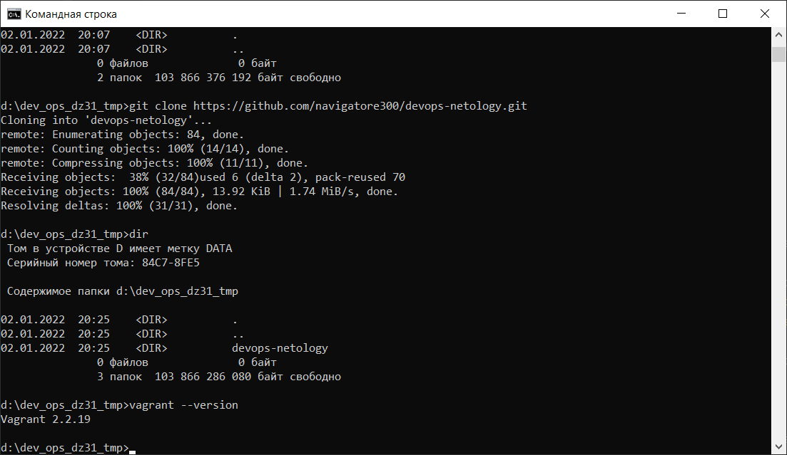
---

3. *В вашем основном окружении подготовьте удобный для дальнейшей работы терминал.*  
---
Обычно хватает командной строки, в некоторых случаях использую терминал powershell. Для внешних подключений MobaXTerm. 
Ради интереса установил Windows terminal.  

Рисунок 3  
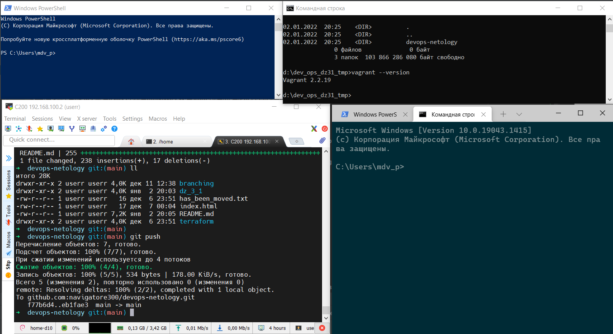
---

4. *С помощью базового файла конфигурации запустите Ubuntu 20.04 в VirtualBox посредством Vagrant:*  
---
Рисунок 4  
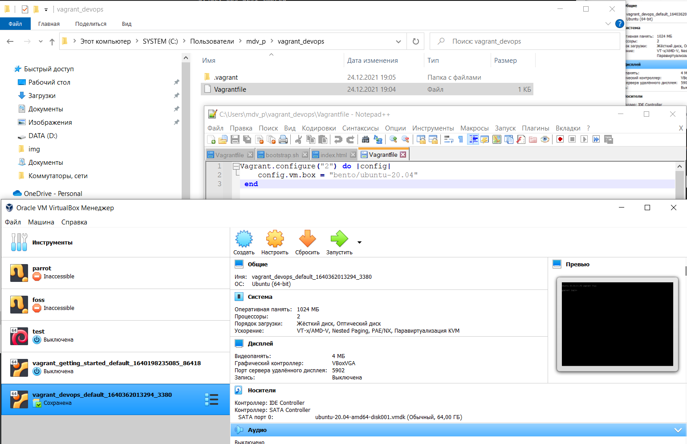    
---

5. *Ознакомьтесь с графическим интерфейсом VirtualBox, посмотрите как выглядит виртуальная машина, которую создал для вас Vagrant, какие аппаратные ресурсы ей выделены. Какие ресурсы выделены по-умолчанию?*  
---
RAM   :1024mb  
CPU   :1 cpu (Максимальная загрузка 100%)  
HDD   :64gb  
video :VBoxVGA 8mb  
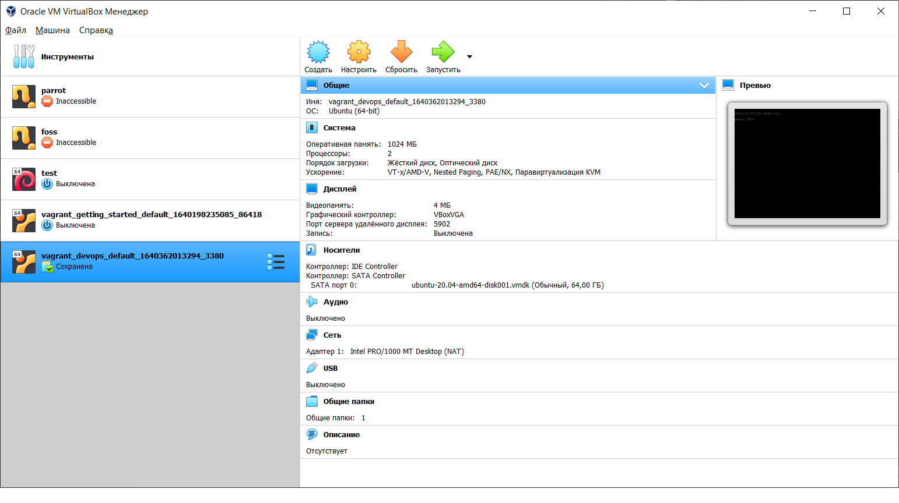
---

6. *Ознакомьтесь с возможностями конфигурации VirtualBox через Vagrantfile: Как добавить оперативной памяти или ресурсов процессора виртуальной машине?*
---
Настройка производится добавлением команд в файл VagrantFile:  
```
config.vm.provider "virtualbox" do |v|  
  v.memory = 2048  
  v.cpus = 2  
end
```
---

7. Команда `vagrant ssh` из директории, в которой содержится Vagrantfile, позволит вам оказаться внутри виртуальной машины без каких-либо дополнительных настроек. Попрактикуйтесь в выполнении обсуждаемых команд в терминале Ubuntu.
---
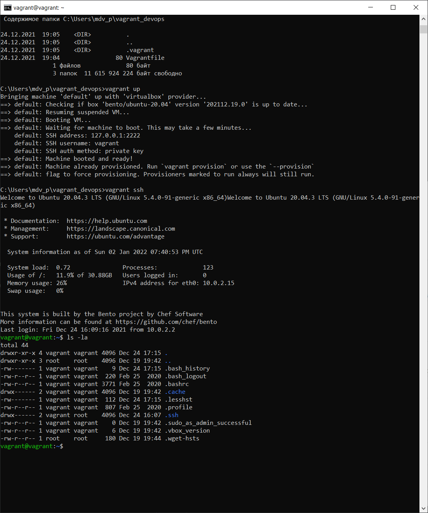
---

8. Ознакомиться с разделами `man bash`, почитать о настройках самого bash:
* какой переменной можно задать длину журнала `history`, и на какой строчке manual это описывается?  
---
HISTFILESIZE - максимальное число строк в файле истории для сохранения, строка 846  
HISTSIZE - число команд для сохранения, строка 862
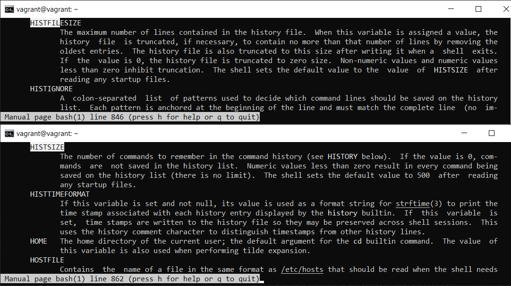
---   
* что делает директива `ignoreboth` в bash?
---
ignoreboth это объеденяющее в себе две дерективы ignorespace и ignoredups: 
    ignorespace - не сохранять команды начинающиеся с пробела, 
    ignoredups - не сохранять команду, если такая уже имеется в истории  
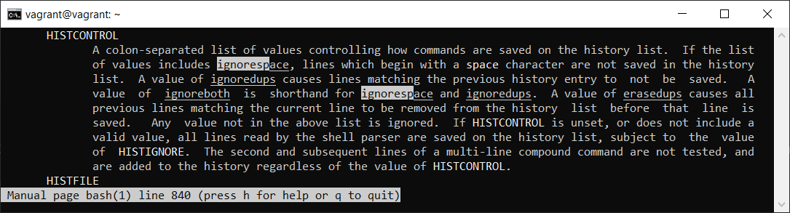
---

9. В каких сценариях использования применимы скобки `{}` и на какой строчке `man bash` это описано?  

---
Строка 258. В фигурные скобки может быть заключена последовательность команд.  
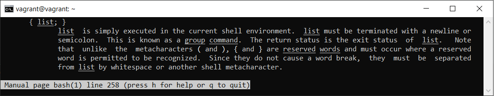  
Строка 1104. Если используется в команде, то выполняет подстановку элементов из списка  

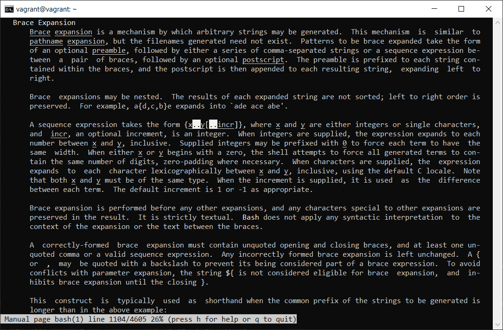  
а так же используется в различных условных циклах, условных операторах, или ограничивает тело функции
---

10. *С учётом ответа на предыдущий вопрос, как создать однократным вызовом `touch` 100000 файлов?  
Получится ли аналогичным образом создать 300000? Если нет, то почему?*  
---
touch {000001..100000}.txt - создаст в текущей директории соответсвующее число фалов.  
300000 может и получится, по крайней мере команда echo {1..300000} ошибки не вызывает, но при создании файлов могут наложиться ограничения файловой системы, свободного места на диске и прочие настройки системы. 

---

11. *В man bash поищите по `/\[\[`. Что делает конструкция `[[ -d /tmp ]]`*
---
Проверяет условие "-d /tmp" и возвращает ее статус (0 или 1), наличие каталога /tmp

Например:

    if [[ -d /tmp ]]
    then
        echo "каталог /tmp есть"
    else
        echo "каталога /tmp не существует"
    fi
---

12. *Основываясь на знаниях о просмотре текущих (например, PATH) и установке новых переменных; командах, которые мы рассматривали, добейтесь в выводе type -a bash в виртуальной машине наличия первым пунктом в списке:*

     ```bash
     bash is /tmp/new_path_directory/bash
     bash is /usr/local/bin/bash
     bash is /bin/bash
     ```

     (прочие строки могут отличаться содержимым и порядком)
     В качестве ответа приведите команды, которые позволили вам добиться указанного вывода или соответствующие скриншоты.
---

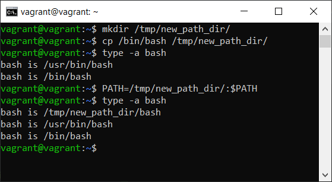

--- 

13. *Чем отличается планирование команд с помощью `batch` и `at`?*

+ at – это утилита командной строки, которая позволяет планировать выполнение команд в определенное время.  
+ batch - для выполнения разовой задачи, когда средняя загрузка опускается ниже 1,5%
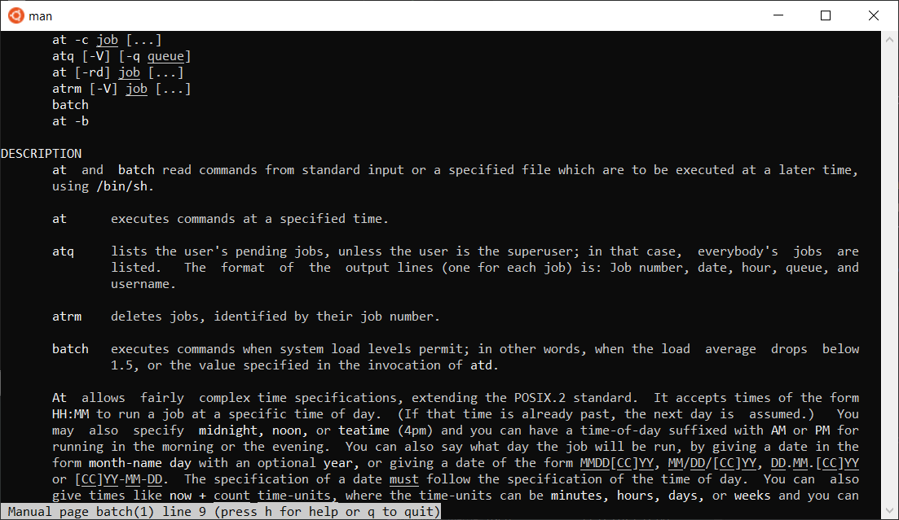

14. *Завершите работу виртуальной машины чтобы не расходовать ресурсы компьютера и/или батарею ноутбука.*  
Для этого необходимо выполнить следующую команду в терминале:  
    ```
    vagrant suspend
    ```