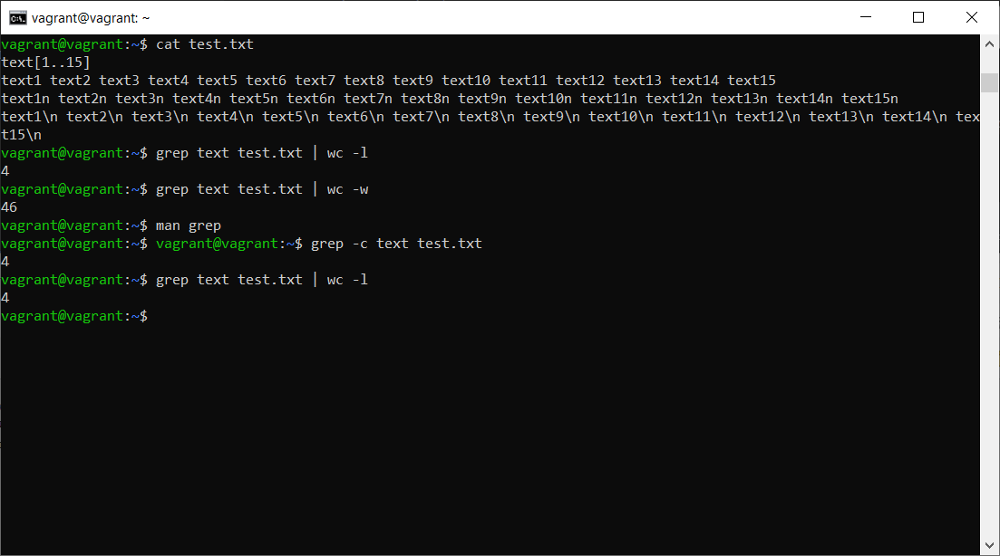
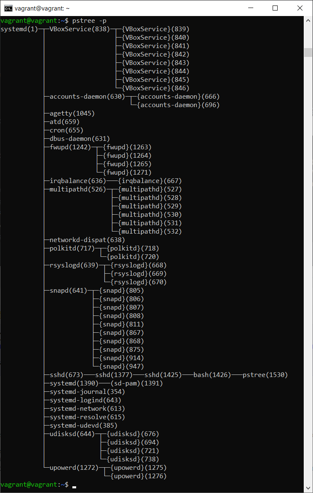
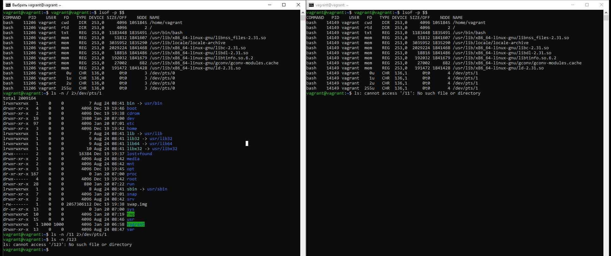
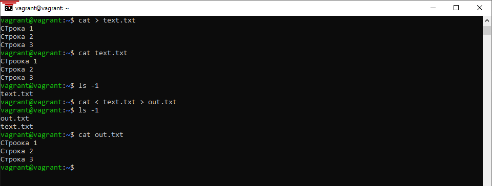
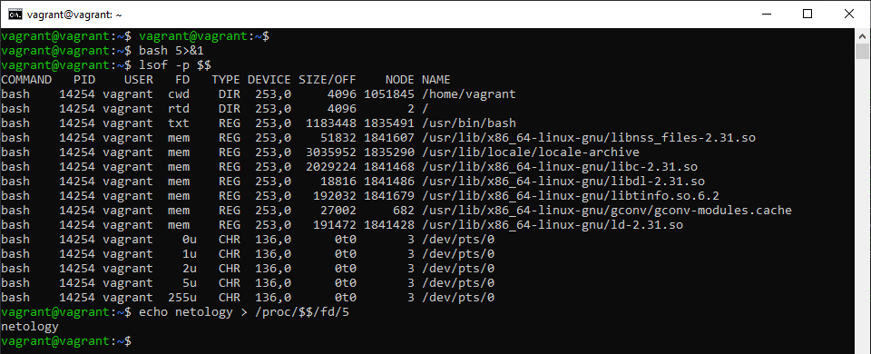
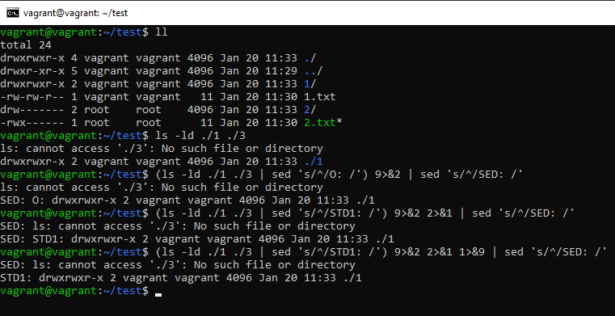
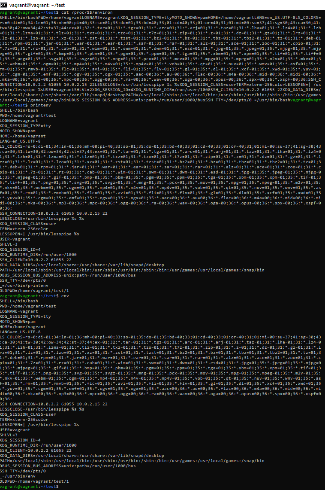
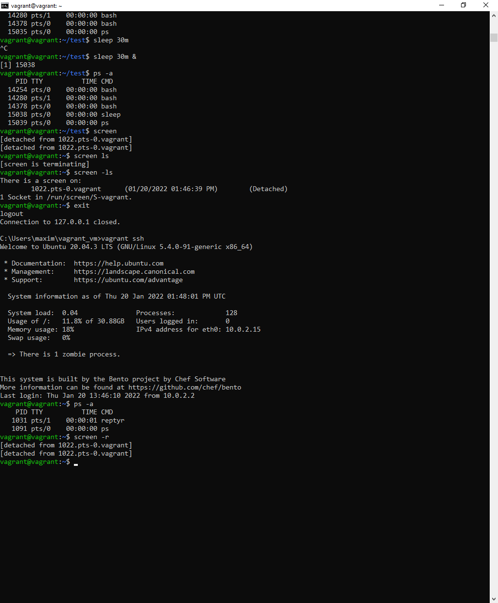

# Домашнее задание к занятию "3.2. Работа в терминале, лекция 2" Максимов Денис

1. Какого типа команда `cd`? Попробуйте объяснить, почему она именно такого типа; опишите ход своих мыслей, если считаете что она могла бы быть другого типа.

_Ответ:_  

Команда `cd` не утилита операционной системы, а встроенная команда оболочки.  
Её задача изменить текущий каталог в работе оболочки, чтобы другие выполняемые команды могли использовать в своей работе путь не абсолютный, а текущий каталог. Если бы команда `cd` была отдельной утилитой, то она была бы наследником процесса который ее вызвал и использовала свои переменные окружения, не имея возможности изменить окружение родительского процесса.   

---
2. Какая альтернатива без pipe команде `grep <some_string> <some_file> | wc -l`? `man grep` поможет в ответе на этот вопрос. Ознакомьтесь с [документом](http://www.smallo.ruhr.de/award.html) о других подобных некорректных вариантах использования pipe.

_Ответ:_

Утилита grep имеет ключ `-с` который выполняет подсчет строк с найденным совпадением.  
   General Output Control  
    -c, --count 
    Suppress normal output; instead print a count of matching lines for each  input  file.  


---
3. Какой процесс с PID `1` является родителем для всех процессов в вашей виртуальной машине Ubuntu 20.04?

_Ответ:_

В виртуальной машине созданной при помощи Vagrant родитель для всех процессов процесс с PID `1` systemd  


---
4. Как будет выглядеть команда, которая перенаправит вывод stderr `ls` на другую сессию терминала?

_Ответ:_

Команда будет выглядеть следующим образом  `ls -n / 2>/dev/pts/1`.  
При ее выполнении сообщения об ошибках будут перенаправлены в консоль другой сессии.


---
5. Получится ли одновременно передать команде файл на stdin и вывести ее stdout в другой файл? Приведите работающий пример.

_Ответ:_

Да можно `cat < text.txt > out.txt` 



---
6. Получится ли находясь в графическом режиме, вывести данные из PTY в какой-либо из эмуляторов TTY? Сможете ли вы наблюдать выводимые данные?

_Ответ:_

Да в linux Mint. Определяем PTY, TTY и перенаправляем вывод в него.  
В графическом `echo hello > /dev/tty2`  
В текстовом`echo Hi > /dev/pts/0`
Переключение в консоль CTRL+ALT+Номер консоли. Графический интерфейс в 7-ой.


---
7. Выполните команду `bash 5>&1`. К чему она приведет? Что будет, если вы выполните `echo netology > /proc/$$/fd/5`? Почему так происходит?

_Ответ:_

bash 5>&1 - Создаст дескриптор под номером 5 и перенаправит его в stdout текущей сессии.  
echo netology > /proc/$$/fd/5 - выведет в дескриптор "5" текст netology, который будет перенаправлен в stdout


---
8. Получится ли в качестве входного потока для pipe использовать только stderr команды, не потеряв при этом отображение stdout на pty? Напоминаем: по умолчанию через pipe передается только stdout команды слева от `|` на stdin команды справа.
Это можно сделать, поменяв стандартные потоки местами через промежуточный новый дескриптор, который вы научились создавать в предыдущем вопросе.

_Ответ:_

Для реализации будем использовать такую конструкцию
`(ls -ld ./1 ./3 | sed 's/^/STD1: /') 9>&2 2>&1 1>&9 | sed 's/^/SED: /'`
Для наглядности строки помечены путями через которые они прошли.


---
9.Что выведет команда `cat /proc/$$/environ`? Как еще можно получить аналогичный по содержанию вывод?

_Ответ:_

Будут выведены переменные окружения:
можно получить это же самое (только с разделением по переменным по строкам):
printenv
env


---
10. Используя `man`, опишите что доступно по адресам `/proc/<PID>/cmdline`, `/proc/<PID>/exe`.

_Ответ:_

+ /proc/\<PID>/cmdline - Этот доступный только для чтения файл содержит полную командную строку для процесса, если этот процесс не является зомби. В последнем случае в этом файле ничего нет: то есть чтение этого файла вернет 0 символов. То
аргументы командной строки отображаются в этом файле как набор строк, разделенных нулевыми байтами ('\0'), с нулевым байтом после последней строки. (строка 223 man proc )  
    > В случае выполнения в терминале `cat /proc/$$/cmdline` выводит `bash`
+ /proc/\<PID>/exe - содержит ссылку до файла запущенного для процесса [PID], ls -l выведет ссылку на экран (строка 276 man proc)  
    > ls -l /proc/$$/exe'  
    > rwxrwxrwx 1 vagrant vagrant 0 Jan 20 10:39 /proc/14280/exe -> /usr/bin/bash`

---
11. Узнайте, какую наиболее старшую версию набора инструкций SSE поддерживает ваш процессор с помощью `/proc/cpuinfo`.

_Ответ:_

Исходя из вывода команды SSE4_2.

    cat /proc/cpuinfo | grep -i sse
    
    flags   : fpu vme de pse tsc msr pae mce cx8 apic sep mtrr pge mca cmov pat pse36 clflush mmx fxsr sse sse2 ht syscall nx rdtscp lm constant_tsc rep_good nopl xtopology nonstop_tsc cpuid tsc_known_freq pni pclmulqdq ssse3 cx16 pcid
    sse4_1 sse4_2 x2apic movbe popcnt aes xsave avx rdrand hypervisor lahf_lm abm 3dnowprefetch invpcid_single pti fsgsbase avx2 invpcid rdseed clflushopt md_clear flush_l1d
    flags   : fpu vme de pse tsc msr pae mce cx8 apic sep mtrr pge mca cmov pat pse36 clflush mmx fxsr sse sse2 ht syscall nx rdtscp lm constant_tsc rep_good nopl xtopology nonstop_tsc cpuid tsc_known_freq pni pclmulqdq ssse3 cx16 pcid
    sse4_1 sse4_2 x2apic movbe popcnt aes xsave avx rdrand hypervisor lahf_lm abm 3dnowprefetch invpcid_single pti fsgsbase avx2 invpcid rdseed clflushopt md_clear flush_l1d

---
12. При открытии нового окна терминала и `vagrant ssh` создается новая сессия и выделяется pty. Это можно подтвердить командой `tty`, которая упоминалась в лекции 3.2. Однако:

      ```bash
      vagrant@netology1:~$ ssh localhost 'tty'
      not a tty
      ```

      Почитайте, почему так происходит, и как изменить поведение.

_Ответ:_

На самом деле причина, по которой это сообщение об ошибке появляется, связана с ошибкой в Ubuntu, которая не проверяет, является ли стандартный ввод TTY, и просто предполагает, что это так.
При подключении ожидается пользователь, а не другой процесс, и нет локального tty в данный момент.

---
13. Бывает, что есть необходимость переместить запущенный процесс из одной сессии в другую. Попробуйте сделать это, воспользовавшись `reptyr`. Например, так можно перенести в `screen` процесс, который вы запустили по ошибке в обычной SSH-сессии.

_Ответ:_

При попытке использовать reptyr программа ругается на права, 10-patrace.conf  
Установил значение kernel.yama.ptrace_scope = 0 в указанном выше файле. 
После этого процесс был перехвачен в screen, и продолжил работу после закрытия терминала. 
Отображаетс процесс не sleep и не скрин, а reptyr. 


---
14. `sudo echo string > /root/new_file` не даст выполнить перенаправление под обычным пользователем, так как перенаправлением занимается процесс shell'а, который запущен без `sudo` под вашим пользователем. Для решения данной проблемы можно использовать конструкцию `echo string | sudo tee /root/new_file`. Узнайте что делает команда `tee` и почему в отличие от `sudo echo` команда с `sudo tee` будет работать.

_Ответ:_


Команда tee делает вывод одновременно и в файл, указанный в качестве параметра, и в stdout, 
в данном примере команда получает вывод из stdin, перенаправленный через pipe от stdout команды echo
и так как команда запущена от sudo, то имеет права на запись в файл
