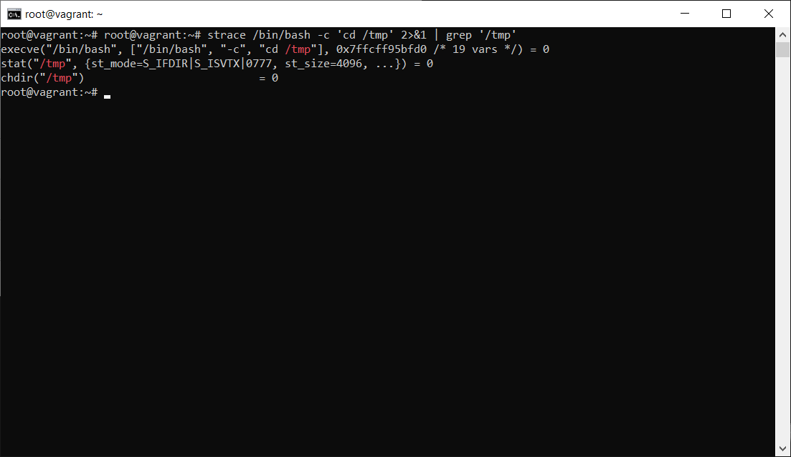

# Домашнее задание к занятию "3.3. Операционные системы, лекция 1" Максимов Денис

1. Какой системный вызов делает команда `cd`? В прошлом ДЗ мы выяснили, что `cd` не является самостоятельной  программой, это `shell builtin`, поэтому запустить `strace` непосредственно на `cd` не получится. Тем не менее, вы можете запустить `strace` на `/bin/bash -c 'cd /tmp'`. В этом случае вы увидите полный список системных вызовов, которые делает сам `bash` при старте. Вам нужно найти тот единственный, который относится именно к `cd`. Обратите внимание, что `strace` выдаёт результат своей работы в поток stderr, а не в stdout.

_Ответ:_  

Системный вызов команды `cd`:  
>chdir("/tmp")



---
2. Попробуйте использовать команду `file` на объекты разных типов на файловой системе. Например:
    ```bash
    vagrant@netology1:~$ file /dev/tty
    /dev/tty: character special (5/0)
    vagrant@netology1:~$ file /dev/sda
    /dev/sda: block special (8/0)
    vagrant@netology1:~$ file /bin/bash
    /bin/bash: ELF 64-bit LSB shared object, x86-64
    ```
    Используя `strace` выясните, где находится база данных `file` на основании которой она делает свои догадки.

_Ответ:_  

Так как в системе линукс всё представляет из себя файл, то вероятнее всего база хранится в файле. А значит пристальное внимание надо уделить на открытые в процессе выполнения файлы. Добавим опции `-e` для фильтрации и `-y` для указания в выводе путей, а не номеров дескриптора.
   ```strace -y -e openat file /dev/tty
   root@vagrant:/etc# strace -y -e openat file /dev/tty
   openat(AT_FDCWD, "/etc/ld.so.cache", O_RDONLY|O_CLOEXEC) = 3</etc/ld.so.cache>
   openat(AT_FDCWD, "/lib/x86_64-linux-gnu/libmagic.so.1", O_RDONLY|O_CLOEXEC) = 3</usr/lib/x86_64-linux-gnu/libmagic.so.1.0.0>
   openat(AT_FDCWD, "/lib/x86_64-linux-gnu/libc.so.6", O_RDONLY|O_CLOEXEC) = 3</usr/lib/x86_64-linux-gnu/libc-2.31.so>
   openat(AT_FDCWD, "/lib/x86_64-linux-gnu/liblzma.so.5", O_RDONLY|O_CLOEXEC) = 3</usr/lib/x86_64-linux-gnu/liblzma.so.5.2.4>
   openat(AT_FDCWD, "/lib/x86_64-linux-gnu/libbz2.so.1.0", O_RDONLY|O_CLOEXEC) = 3</usr/lib/x86_64-linux-gnu/libbz2.so.1.0.4>
   openat(AT_FDCWD, "/lib/x86_64-linux-gnu/libz.so.1", O_RDONLY|O_CLOEXEC) = 3</usr/lib/x86_64-linux-gnu/libz.so.1.2.11>
   openat(AT_FDCWD, "/lib/x86_64-linux-gnu/libpthread.so.0", O_RDONLY|O_CLOEXEC) = 3</usr/lib/x86_64-linux-gnu/libpthread-2.31.so>
   openat(AT_FDCWD, "/usr/lib/locale/locale-archive", O_RDONLY|O_CLOEXEC) = 3</usr/lib/locale/locale-archive>
   openat(AT_FDCWD, "/etc/magic.mgc", O_RDONLY) = -1 ENOENT (No such file or directory)
   openat(AT_FDCWD, "/etc/magic", O_RDONLY) = 3</etc/magic>
   openat(AT_FDCWD, "/usr/share/misc/magic.mgc", O_RDONLY) = 3</usr/lib/file/magic.mgc>
   openat(AT_FDCWD, "/usr/lib/x86_64-linux-gnu/gconv/gconv-modules.cache", O_RDONLY) = 3</usr/lib/x86_64-linux-gnu/gconv/gconv-modules.cache>
   /dev/tty: character special (5/0)```
   +++ exited with 0 +++ 
```

В основном библиотеки, но вот есть несколько интересных файлов:
+ /usr/lib/locale/locale-archive
+ /etc/magic.mgc
+ /etc/magic
+ /usr/share/misc/magic.mgc
+ /usr/lib/x86_64-linux-gnu/gconv/gconv-modules.cache

Проанализировав существующие файлы, выяснил что, содержат слова character, block, ELF файл  `/usr/share/misc/magic.mgc`  
Следственно утилита `file` определяет тип файла исходя из данных файла `/usr/share/misc/magic.mgc`


---

3. Предположим, приложение пишет лог в текстовый файл. Этот файл оказался удален (deleted в lsof), однако возможности сигналом сказать приложению переоткрыть файлы или просто перезапустить приложение – нет. Так как приложение продолжает писать в удаленный файл, место на диске постепенно заканчивается. Основываясь на знаниях о перенаправлении потоков предложите способ обнуления открытого удаленного файла (чтобы освободить место на файловой системе).

_Ответ:_  


---
4. Занимают ли зомби-процессы какие-то ресурсы в ОС (CPU, RAM, IO)?

_Ответ:_  

Зомби-процессы, в отличие от "осиротевших" освобождают свои ресурсы (т.е. не занимают ресурсы в ОС [CPU, RAM, IO]), но не освобождают запись в таблице процессов. 
Запись освободиться при вызове wait() родительским процессом. 

---
5. В iovisor BCC есть утилита `opensnoop`:
    ```bash
    root@vagrant:~# dpkg -L bpfcc-tools | grep sbin/opensnoop
    /usr/sbin/opensnoop-bpfcc
    ```
    На какие файлы вы увидели вызовы группы `open` за первую секунду работы утилиты? Воспользуйтесь пакетом `bpfcc-tools` для Ubuntu 20.04. Дополнительные [сведения по установке](https://github.com/iovisor/bcc/blob/master/INSTALL.md).

_Ответ:_  


---
6. Какой системный вызов использует `uname -a`? Приведите цитату из man по этому системному вызову, где описывается альтернативное местоположение в `/proc`, где можно узнать версию ядра и релиз ОС.

_Ответ:_  

Команда `uname -a` использует системный вызов uname().  
uname() - returns system information in the structure pointed to by buf  
В документации в строке 51, доступной по команде `man 2 uname` говорится:
> Part of the utsname information is also accessible via /proc/sys/kernel/{ostype, hostname, osrelease, version, domainname}.

Информация собирается из  proc/sys/kernel/{ostype, hostname, osrelease, version, domainname}

---
7. Чем отличается последовательность команд через `;` и через `&&` в bash? Например:
    ```bash
    root@netology1:~# test -d /tmp/some_dir; echo Hi
    Hi
    root@netology1:~# test -d /tmp/some_dir && echo Hi
    root@netology1:~#
    ```
    Есть ли смысл использовать в bash `&&`, если применить `set -e`?

_Ответ:_  

; - разделитель последовательных команд;  
&& - управляющий оператор. Если в командной строке стоит command1 && command2, то command2 выполняется в том, и только в том случае, если статус выхода из команды command1 равен нулю, что говорит об успешном ее завершении.  

test -d /tmp/some_dir && echo Hi - в данном случае echo  отработает только при успешном заверщении команды test

Опция `set -e` - прерывает сессию при любом ненулевом значении исполняемых команд в конвеере кроме последней.
В случае использования опции `set -e` практической пользы применения управляющего оператора `&&` нет, но с точки зрения логики при применении его наглядно видно, что выполнение второй команды зависит от выполнения первой. 

---
8. Из каких опций состоит режим bash `set -euxo pipefail` и почему его хорошо было бы использовать в сценариях?

_Ответ:_  

-e прерывает выполнение исполнения скрипта(последующих комманд) при ошибке в любой команде, кроме последней в последовательности.  
-x Печатать команды и их аргументы по мере их выполнения.  
-u неустановленные/не заданные параметры и переменные считаются как ошибки, с выводом в stderr текста ошибки и выполнит завершение не интерактивного вызова.  
-o pipefail Если опция pipefail включена — статус выхода из конвейера является значением последней (самой правой) команды, завершённой с ненулевым статусом, или ноль — если работа всех команд завершена успешно.    

Использование в сценарии вышеупомянутой комбинации, повышает детализацию вывода результата работы скрипта и дутализация вывода ошибок, ели они появляются, а также позволяет завершить сценарий при возникновении ошибок, на любом этапе выполнения сценария, кроме последней завершающей команды.  
Но в интернете встречаются и противники использования некоторых опций повсеместно. Все зависит от задач которые возлагает на данную опцию автор скрипта. Не всегда стоит надеяться на опцию, а продумывать детально алгоритм. Но в обобщении применение опций может помочь избежать грубых ошибок.  

---
9. Используя `-o stat` для `ps`, определите, какой наиболее часто встречающийся статус у процессов в системе. В `man ps` ознакомьтесь (`/PROCESS STATE CODES`) что значат дополнительные к основной заглавной буквы статуса процессов. Его можно не учитывать при расчете (считать S, Ss или Ssl равнозначными).

_Ответ:_  

Наиболее часто встречающийся статус `S`- c учетом того что доп параметры не учитываются при расчете. (сон который может быть прерван по событию (ожидание завершения какого-то события))
```
vagrant@vagrant:~$ ps -A -o stat | sort | uniq -c | sort -nr
     38 I<
     25 S
     13 Ss
      8 Ssl
      8 I
      7 S<
      3 S+
      2 SN
      1 STAT
      1 Ss+
      1 S<s
      1 SLsl
      1 Sl
      1 R+
```

Дополнительные символы - это доп. характеристики, например приоритет, признак мультипоточности и т.д.


---
