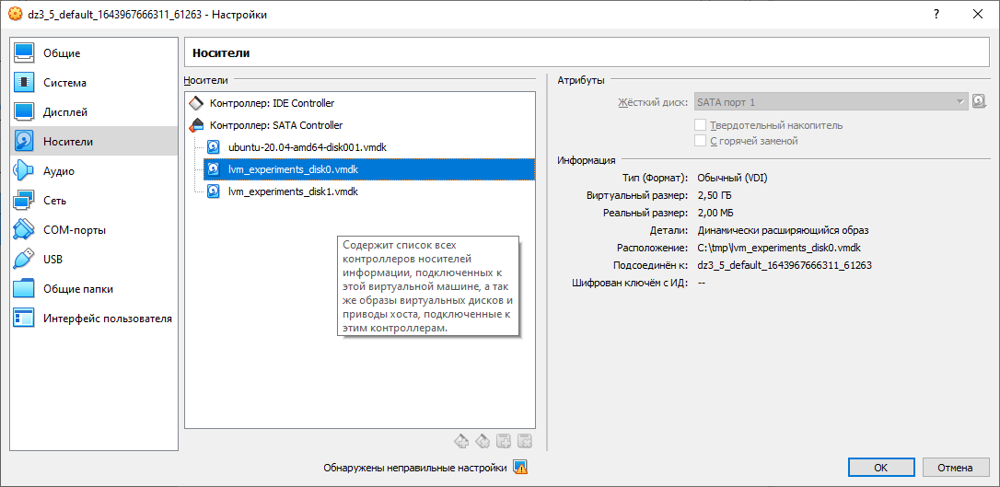

1. Узнайте о sparse (разряженных) файлах.

_Ответ_

Разрежённый файл (англ. sparse file) — файл, в котором последовательности нулевых байтов заменены на информацию об этих последовательностях (список дыр)  

Преимущества:

+ экономия дискового пространства. Использование разрежённых файлов считается одним из способов сжатия данных на уровне файловой системы;
+ отсутствие временных затрат на запись нулевых байт;
+ увеличение срока службы запоминающих устройств.

Недостатки:

+ накладные расходы на работу со списком дыр;
+ фрагментация файла при частой записи данных в дыры;
+ невозможность записи данных в дыры при отсутствии свободного места на диске;
+ невозможность использования других индикаторов дыр, кроме нулевых байт.

---

2. Могут ли файлы, являющиеся жесткой ссылкой на один объект, иметь разные права доступа и владельца? Почему?

_Ответ_

Так как жесткая ссылка это ссылка на тот же самый файл и имеет тот же inode то права будут одни и те же.
Так как права на доступ хранятся в таблице inode.

---

3. Сделайте vagrant destroy на имеющийся инстанс Ubuntu. Замените содержимое Vagrantfile следующим:

Vagrant.configure("2") do |config|
  config.vm.box = "bento/ubuntu-20.04"
  config.vm.provider :virtualbox do |vb|
    lvm_experiments_disk0_path = "/tmp/lvm_experiments_disk0.vmdk"
    lvm_experiments_disk1_path = "/tmp/lvm_experiments_disk1.vmdk"
    vb.customize ['createmedium', '--filename', lvm_experiments_disk0_path, '--size', 2560]
    vb.customize ['createmedium', '--filename', lvm_experiments_disk1_path, '--size', 2560]
    vb.customize ['storageattach', :id, '--storagectl', 'SATA Controller', '--port', 1, '--device', 0, '--type', 'hdd', '--medium', lvm_experiments_disk0_path]
    vb.customize ['storageattach', :id, '--storagectl', 'SATA Controller', '--port', 2, '--device', 0, '--type', 'hdd', '--medium', lvm_experiments_disk1_path]
  end
end
Данная конфигурация создаст новую виртуальную машину с двумя дополнительными неразмеченными дисками по 2.5 Гб.

_Ответ_




---

4. Используя fdisk, разбейте первый диск на 2 раздела: 2 Гб, оставшееся пространство.

_Ответ_

```bash
root@vagrant:~# fdisk /dev/sdb

Welcome to fdisk (util-linux 2.34).
Changes will remain in memory only, until you decide to write them.
Be careful before using the write command.

Device does not contain a recognized partition table.
Created a new DOS disklabel with disk identifier 0x5ae0dd95.

Command (m for help): i
No partition is defined yet!

Command (m for help): n
Partition type
   p   primary (0 primary, 0 extended, 4 free)
   e   extended (container for logical partitions)
Select (default p):

Using default response p.
Partition number (1-4, default 1):
First sector (2048-5242879, default 2048):
Last sector, +/-sectors or +/-size{K,M,G,T,P} (2048-5242879, default 5242879): +2G

Created a new partition 1 of type 'Linux' and of size 2 GiB.

Command (m for help): n
Partition type
   p   primary (1 primary, 0 extended, 3 free)
   e   extended (container for logical partitions)
Select (default p):

Using default response p.
Partition number (2-4, default 2):
First sector (4196352-5242879, default 4196352):
Last sector, +/-sectors or +/-size{K,M,G,T,P} (4196352-5242879, default 5242879):

Created a new partition 2 of type 'Linux' and of size 511 MiB.

Command (m for help): w
The partition table has been altered.
Calling ioctl() to re-read partition table.
Syncing disks.
```

---

5. Используя sfdisk, перенесите данную таблицу разделов на второй диск.


_Ответ_

```bash
root@vagrant:~# sfdisk -d /dev/sdb > sdb-tables.dump
root@vagrant:~# cat sdb-tables.dump
label: dos
label-id: 0x5ae0dd95
device: /dev/sdb
unit: sectors

/dev/sdb1 : start=        2048, size=     4194304, type=83
/dev/sdb2 : start=     4196352, size=     1046528, type=83

root@vagrant:~# sfdisk /dev/sdc < sdb-tables.dump
Checking that no-one is using this disk right now ... OK

Disk /dev/sdc: 2.51 GiB, 2684354560 bytes, 5242880 sectors
Disk model: VBOX HARDDISK
Units: sectors of 1 * 512 = 512 bytes
Sector size (logical/physical): 512 bytes / 512 bytes
I/O size (minimum/optimal): 512 bytes / 512 bytes

>>> Script header accepted.
>>> Script header accepted.
>>> Script header accepted.
>>> Script header accepted.
>>> Created a new DOS disklabel with disk identifier 0x5ae0dd95.
/dev/sdc1: Created a new partition 1 of type 'Linux' and of size 2 GiB.
/dev/sdc2: Created a new partition 2 of type 'Linux' and of size 511 MiB.
/dev/sdc3: Done.

New situation:
Disklabel type: dos
Disk identifier: 0x5ae0dd95

Device     Boot   Start     End Sectors  Size Id Type
/dev/sdc1          2048 4196351 4194304    2G 83 Linux
/dev/sdc2       4196352 5242879 1046528  511M 83 Linux

The partition table has been altered.
Calling ioctl() to re-read partition table.
Syncing disks.
```

---

6. Соберите mdadm RAID1 на паре разделов 2 Гб.

_Ответ_
```bash
root@vagrant:~# mdadm --create /dev/md0 --level=1 --raid-devices=2 /dev/sd[bc]1
mdadm: Note: this array has metadata at the start and
    may not be suitable as a boot device.  If you plan to
    store '/boot' on this device please ensure that
    your boot-loader understands md/v1.x metadata, or use
    --metadata=0.90
Continue creating array? y
mdadm: Defaulting to version 1.2 metadata
mdadm: array /dev/md0 started.
```
---

7. Соберите mdadm RAID0 на второй паре маленьких разделов.

_Ответ_
```bash
root@vagrant:~# mdadm --create /dev/md1 --level=0 --raid-devices=2 /dev/sd[bc]2
mdadm: Defaulting to version 1.2 metadata
mdadm: array /dev/md1 started.
```
---

8. Создайте 2 независимых PV на получившихся md-устройствах.

_Ответ_
```
root@vagrant:~# pvcreate /dev/md0
  Physical volume "/dev/md0" successfully created.

root@vagrant:~# pvcreate /dev/md1
  Physical volume "/dev/md1" successfully created.

root@vagrant:~# pvs
  PV         VG        Fmt  Attr PSize    PFree
  /dev/md0             lvm2 ---    <2.00g   <2.00g
  /dev/md1             lvm2 ---  1018.00m 1018.00m
  /dev/sda3  ubuntu-vg lvm2 a--   <63.00g  <31.50g
```
---

9. Создайте общую volume-group на этих двух PV.

_Ответ_

```
root@vagrant:~# vgcreate my_vg /dev/md0 /dev/md1
  Volume group "my_vg" successfully created

root@vagrant:~# vgs
  VG        #PV #LV #SN Attr   VSize   VFree
  my_vg       2   0   0 wz--n-  <2.99g  <2.99g
  ubuntu-vg   1   1   0 wz--n- <63.00g <31.50g
```
---

10. Создайте LV размером 100 Мб, указав его расположение на PV с RAID0.

_Ответ_
```
root@vagrant:~# lvcreate -L 100m -n 100m-lv my_vg /dev/md1
  Logical volume "100m-lv" created.

root@vagrant:~# lvs
  LV        VG        Attr       LSize   Pool Origin Data%  Meta%  Move Log Cpy%Sync Convert
  100m-lv   my_vg     -wi-a----- 100.00m
  ubuntu-lv ubuntu-vg -wi-ao----  31.50g
  
root@vagrant:~# lvs -o +devices
  LV        VG        Attr       LSize   Pool Origin Data%  Meta%  Move Log Cpy%Sync Convert Devices
  100m-lv   my_vg     -wi-a----- 100.00m                                                     /dev/md1(0)
  ubuntu-lv ubuntu-vg -wi-ao----  31.50g                                                     /dev/sda3(0)
```

---

11. Создайте mkfs.ext4 ФС на получившемся LV.

_Ответ_

```
root@vagrant:~# mkfs.ext4 -L LV_EXT4 -m 1 /dev/mapper/my_vg-100m--lv
mke2fs 1.45.5 (07-Jan-2020)
Creating filesystem with 25600 4k blocks and 25600 inodes

Allocating group tables: done
Writing inode tables: done
Creating journal (1024 blocks): done
Writing superblocks and filesystem accounting information: done
```
---

12. Смонтируйте этот раздел в любую директорию, например, /tmp/new.

_Ответ_

```angular2html
root@vagrant:~# mount /dev/mapper/my_vg-100m--lv /tmp/new

root@vagrant:~# mount | grep new
/dev/mapper/my_vg-100m--lv on /tmp/new type ext4 (rw,relatime,stripe=256)
```

---

13. Поместите туда тестовый файл, например wget https://mirror.yandex.ru/ubuntu/ls-lR.gz -O /tmp/new/test.gz.

_Ответ_
```
root@vagrant:~# cd /tmp/new/

root@vagrant:/tmp/new# wget https://mirror.yandex.ru/ubuntu/ls-lR.gz -O /tmp/new/test.gz
--2022-02-04 18:24:44--  https://mirror.yandex.ru/ubuntu/ls-lR.gz
Resolving mirror.yandex.ru (mirror.yandex.ru)... 213.180.204.183, 2a02:6b8::183
Connecting to mirror.yandex.ru (mirror.yandex.ru)|213.180.204.183|:443... connected.
HTTP request sent, awaiting response... 200 OK
Length: 22166357 (21M) [application/octet-stream]
Saving to: ‘/tmp/new/test.gz’
/tmp/new/test.gz           100%[======================================>]  21.14M  8.41MB/s    in 2.5s
2022-02-04 18:24:47 (8.41 MB/s) - ‘/tmp/new/test.gz’ saved [22166357/22166357]

root@vagrant:/tmp/new# ls
lost+found  test.gz
```
---

14. Прикрепите вывод lsblk.

_Ответ_

```angular2html
root@vagrant:/tmp/new# lsblk
NAME                      MAJ:MIN RM  SIZE RO TYPE  MOUNTPOINT
loop0                       7:0    0 55.4M  1 loop  /snap/core18/2128
loop1                       7:1    0 32.3M  1 loop  /snap/snapd/12704
loop2                       7:2    0 70.3M  1 loop  /snap/lxd/21029
loop3                       7:3    0 55.5M  1 loop  /snap/core18/2284
loop4                       7:4    0 43.4M  1 loop  /snap/snapd/14549
loop5                       7:5    0 61.9M  1 loop  /snap/core20/1328
loop6                       7:6    0 67.2M  1 loop  /snap/lxd/21835
sda                         8:0    0   64G  0 disk
├─sda1                      8:1    0    1M  0 part
├─sda2                      8:2    0    1G  0 part  /boot
└─sda3                      8:3    0   63G  0 part
  └─ubuntu--vg-ubuntu--lv 253:0    0 31.5G  0 lvm   /
sdb                         8:16   0  2.5G  0 disk
├─sdb1                      8:17   0    2G  0 part
│ └─md0                     9:0    0    2G  0 raid1
└─sdb2                      8:18   0  511M  0 part
  └─md1                     9:1    0 1018M  0 raid0
    └─my_vg-100m--lv      253:1    0  100M  0 lvm   /tmp/new
sdc                         8:32   0  2.5G  0 disk
├─sdc1                      8:33   0    2G  0 part
│ └─md0                     9:0    0    2G  0 raid1
└─sdc2                      8:34   0  511M  0 part
  └─md1                     9:1    0 1018M  0 raid0
    └─my_vg-100m--lv      253:1    0  100M  0 lvm   /tmp/new
```

---

15. Протестируйте целостность файла:

root@vagrant:~# gzip -t /tmp/new/test.gz
root@vagrant:~# echo $?
0

_Ответ_

root@vagrant:/tmp/new# gzip -t /tmp/new/test.gz
root@vagrant:/tmp/new# echo $?
0

---

16. Используя pvmove, переместите содержимое PV с RAID0 на RAID1.

_Ответ_
```
root@vagrant:/tmp/new# pvmove -n 100m-lv /dev/md1 /dev/md0
  /dev/md1: Moved: 16.00%
  /dev/md1: Moved: 100.00%
```
---

17. Сделайте --fail на устройство в вашем RAID1 md.

_Ответ_

```angular2html
root@vagrant:/tmp/new# mdadm --fail /dev/md0 /dev/sdc1
mdadm: set /dev/sdc1 faulty in /dev/md0
```

---

18. Подтвердите выводом dmesg, что RAID1 работает в деградированном состоянии.

_Ответ_

```angular2html
root@vagrant:/tmp/new# dmesg | grep md0 | tail -n 10
[ 4172.881226] md/raid1:md0: not clean -- starting background reconstruction
[ 4172.881228] md/raid1:md0: active with 2 out of 2 mirrors
[ 4172.881242] md0: detected capacity change from 0 to 2144337920
[ 4172.882900] md: resync of RAID array md0
[ 4183.462885] md: md0: resync done.
[32099.678337] md/raid1:md0: Disk failure on sdc1, disabling device.
               md/raid1:md0: Operation continuing on 1 devices.
```

---

19. Протестируйте целостность файла, несмотря на "сбойный" диск он должен продолжать быть доступен:

root@vagrant:~# gzip -t /tmp/new/test.gz  
root@vagrant:~# echo $?
0

_Ответ_
```
root@vagrant:/tmp/new# gzip -t /tmp/new/test.gz
root@vagrant:/tmp/new# echo $?
0
```

---

20. Погасите тестовый хост, vagrant destroy.

_Ответ_

Выполнено.

---
