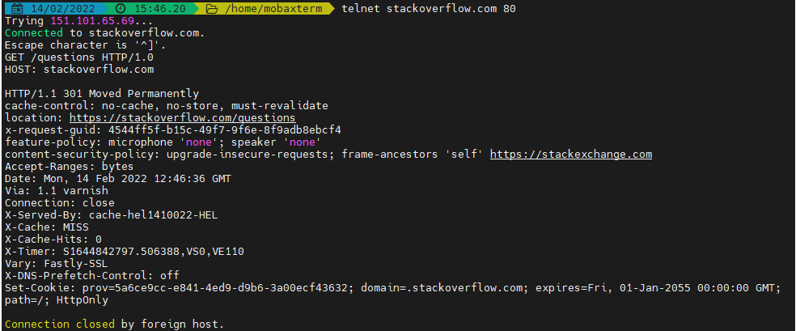
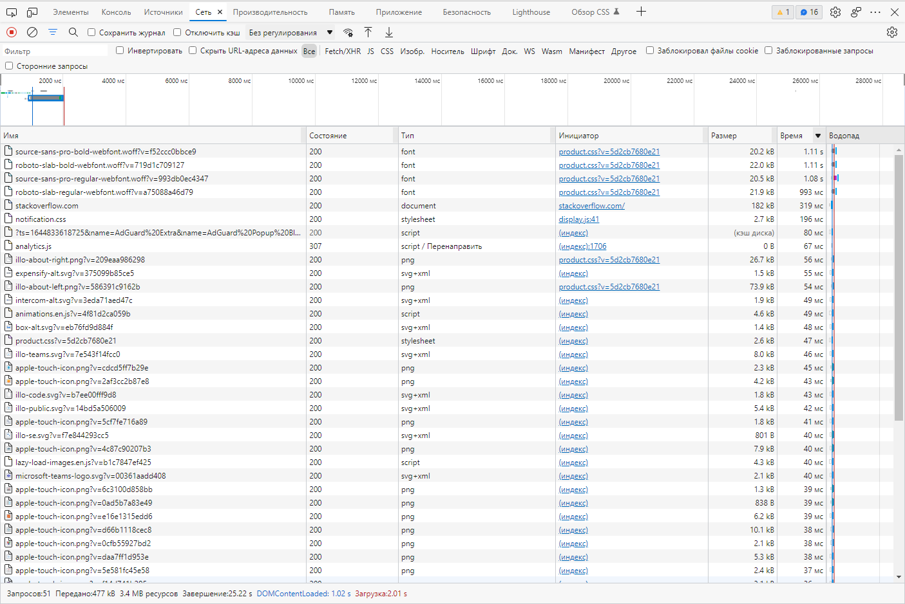
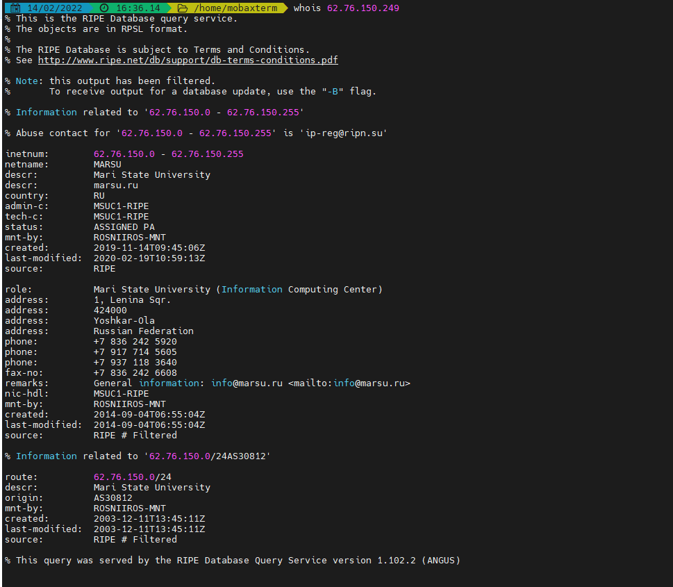

1. Работа c HTTP через телнет.
Подключитесь утилитой телнет к сайту stackoverflow.com telnet stackoverflow.com 80  
отправьте HTTP запрос  
GET /questions HTTP/1.0  
HOST: stackoverflow.com  
[press enter]  
[press enter]  
В ответе укажите полученный HTTP код, что он означает?  

_Ответ:_

Запрашиваем данные из каталога questions сайта stackoverflow.com. В ответе получаем редирект (код 301) c адресом 
переадресации на тот же адрес, но по протоколу https указанное в location.  


___
2. Повторите задание 1 в браузере, используя консоль разработчика F12.  
+ откройте вкладку Network  
+ отправьте запрос http://stackoverflow.com  
+ найдите первый ответ HTTP сервера, откройте вкладку Headers  
+ укажите в ответе полученный HTTP код.  
+ проверьте время загрузки страницы, какой запрос обрабатывался дольше всего?  
+ приложите скриншот консоли браузера в ответ.  

_Ответ:_  

В консоли видно, что получен ответ код 307 временное перенаправление.  

  

Время загрузки станицы 2,01 сек. Самое длительное 1,11 сек - загрузка шрифтов.  

___


3. Какой IP адрес у вас в интернете?

_Ответ:_  


___

4. Какому провайдеру принадлежит ваш IP адрес?    
Какой автономной системе AS?  
Воспользуйтесь утилитой `whois`  

_Ответ_  

Адрес принадлежит оператору  
netname:        MARSU  
Наша организация смеет свой AS.

Номер AS  
origin:         AS30812



5. Через какие сети проходит пакет, отправленный с вашего компьютера на адрес 8.8.8.8?  
Через какие AS?  
Воспользуйтесь утилитой `traceroute`

_Ответ:_  

При попытке отобразить маршрут до 8.8.8.8 в виртуальной машине выдает *-ки, на обычной все нормально. Делал из дома AS другой.  
  

___

6. Повторите задание 5 в утилите `mtr`.  
На каком участке наибольшая задержка - delay?

_Ответ:_  

При использовании утилиты mtr получился следующий результат(на картинке). Наибольшая задержка на узле AS15169 72.14.238.168 средняя 29,6


7. Какие DNS сервера отвечают за доменное имя dns.google?  
Какие A записи?  
воспользуйтесь утилитой `dig`


_Ответ_
>root@home-d10:~# dig +trace @8.8.8.8 dns.google

```commandline
;; Received 758 bytes from 192.112.36.4#53(g.root-servers.net) in 118 ms

dns.google.             10800   IN      NS      ns4.zdns.google.
dns.google.             10800   IN      NS      ns3.zdns.google.
dns.google.             10800   IN      NS      ns1.zdns.google.
dns.google.             10800   IN      NS      ns2.zdns.google.
```

A записи:
```commandline
;; Received 506 bytes from 216.239.32.105#53(ns-tld1.charlestonroadregistry.com) in 57 ms

dns.google.             900     IN      A       8.8.4.4
dns.google.             900     IN      A       8.8.8.8

```

8. Проверьте PTR записи для IP адресов из задания 7.  
Какое доменное имя привязано к IP?  
воспользуйтесь утилитой `dig`

_Ответ_  

>root@home-d10:~# dig -x 8.8.4.4

```commandline
;; ANSWER SECTION:
4.4.8.8.in-addr.arpa.   1442    IN      PTR     dns.google.
```
>root@home-d10:~# dig -x 8.8.8.8

```commandline
;; ANSWER SECTION:
8.8.8.8.in-addr.arpa.   3600    IN      PTR     dns.google.
```