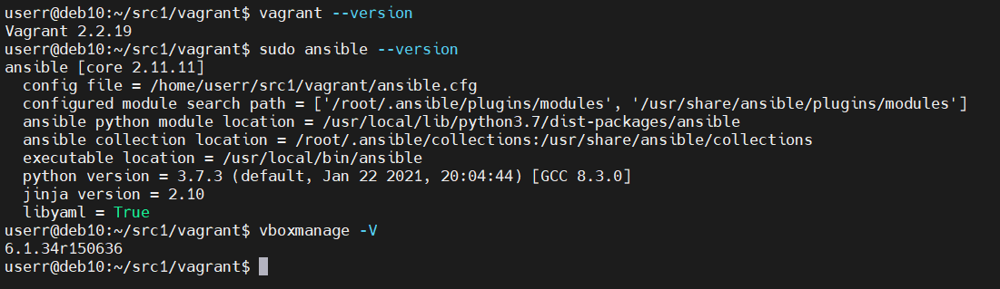

# Домашнее задание к занятию "5.2. Применение принципов IaaC в работе с виртуальными машинами"

---

## Задача 1

- Опишите своими словами основные преимущества применения на практике IaaC паттернов.
- Какой из принципов IaaC является основополагающим?

_Ответ :_

Преимущество применения на практике инфраструктуры как кода заключается в том:
- что при миграции и развертывании инфраструктуры на другой площадке она будет повторять ровно ту, 
что была описана кодом,  
- оперативность развертывания при масштабировании,
- среда разработки, тестирования и работы системы легко развертываются.

Главный принцип IaaC идемпотентность - результат и свойтва не зависят от количества выполнения кода.
## Задача 2

- Чем Ansible выгодно отличается от других систем управление конфигурациями?
- Какой, на ваш взгляд, метод работы систем конфигурации более надёжный push или pull?

_Ответ :_

Преимущества Ansible по сравнению с другими аналогичными решениями заключаются в следующем:

- на управляемые узлы не нужно устанавливать никакого дополнительного ПО, всё работает через SSH;
- код программы, написанный на Python, очень прост; 
- при необходимости написание дополнительных модулей не составляет особого труда;
- язык, на котором пишутся сценарии, также предельно прост;
- низкий порог вхождения: обучиться работе с Ansible можно за очень короткое время;
- документация к продукту написана очень подробно и вместе с тем — просто и понятно; она регулярно обновляется;
- Ansible работает не только в режиме push, но и pull, как это делают большинство систем управления (Puppet, Chef);
- имеется возможность последовательного обновления состояния узлов (rolling update).

На мой взгляд pull позволяет более наглядно контролировать выполнение, но в случае большого количества управляемых машин. 

## Задача 3

Установить на личный компьютер:

- VirtualBox
- Vagrant
- Ansible

*Приложить вывод команд установленных версий каждой из программ, оформленный в markdown.*


- VirtualBox Install
```
sudo touch /etc/apt/sources.list.d/oracle-virtualbox.list
sudo echo "deb https://download.virtualbox.org/virtualbox/debian buster contrib" >> deb https://download.virtualbox.org/virtualbox/debian buster contrib
sudo wget -q https://www.virtualbox.org/download/oracle_vbox_2016.asc -O- | sudo apt-key add -
sudo apt-get update
sudo apt-get install -y gnupg2
sudo apt-get dist-upgrade
sudo reboot
sudo apt-get install linux-headers-$(uname -r)
sudo apt-get install virtualbox-6.1
```
- Vagrant Install
```
apt update
apt install curl apt-add-repository software-properties-common
curl -fsSL https://apt.releases.hashicorp.com/gpg | sudo apt-key add -
apt-add-repository "deb [arch=amd64] https://apt.releases.hashicorp.com $(lsb_release -cs) main"
apt update && sudo apt install vagrant
```
- Ansible Install
```
pip3 install ansible
```

## Задача 4 (*)

Воспроизвести практическую часть лекции самостоятельно.

- Создать виртуальную машину.
- Зайти внутрь ВМ, убедиться, что Docker установлен с помощью команды
```
docker ps
```

_Ответ :_

