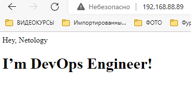

# Домашнее задание к занятию "5.3. Введение. Экосистема. Архитектура. Жизненный цикл Docker контейнера"

---

## Задача 1

Сценарий выполения задачи:

- создайте свой репозиторий на https://hub.docker.com;
- выберете любой образ, который содержит веб-сервер Nginx;
- создайте свой fork образа;
  - реализуйте функциональность:
  запуск веб-сервера в фоне с индекс-страницей, содерnano Vaжащей HTML-код ниже:
```
<html>
<head>
Hey, Netology
</head>
<body>
<h1>I’m DevOps Engineer!</h1>
</body>
</html>
```
Опубликуйте созданный форк в своем репозитории и предоставьте ответ в виде ссылки на https://hub.docker.com/username_repo.

---

_Ответ:_  

`nano index.html`  
```angular2html
<meta charset="UTF-8">
<html>
<head>
Hey, Netology
</head>
<body>
<h1>I’m DevOps Engineer!</h1>
</body>
</html>
```
`nano Dockerfile`  
```angular2html
FROM nginx:stable
COPY index.html /usr/share/nginx/html/index.html
```
`docker build -t maximden/nginx:v1 .`  
`docker run --rm -d --name my_web -p 80:80 maximden/nginx:v1`  



`docker login`  
`docker tag maximden/nginx:v1 maximden/devops.netology:nginx_my`  
`docker push maximden/devops.netology:nginx_my`  

Ссылка на образ в Docker Hub:  https://hub.docker.com/r/maximden/devops.netology

---

## Задача 2

Посмотрите на сценарий ниже и ответьте на вопрос:
"Подходит ли в этом сценарии использование Docker контейнеров или лучше подойдет виртуальная машина, физическая машина? Может быть возможны разные варианты?"

Детально опишите и обоснуйте свой выбор.

--

Сценарий:

- Высоконагруженное монолитное java веб-приложение;
- Nodejs веб-приложение;
- Мобильное приложение c версиями для Android и iOS;
- Шина данных на базе Apache Kafka;
- Elasticsearch кластер для реализации логирования продуктивного веб-приложения - три ноды elasticsearch, два logstash и две ноды kibana;
- Мониторинг-стек на базе Prometheus и Grafana;
- MongoDB, как основное хранилище данных для java-приложения;
- Gitlab сервер для реализации CI/CD процессов и приватный (закрытый) Docker Registry.

---

_Ответ:_

> Высоконагруженное монолитное java веб-приложение;

Контейнеры будет удобней виртуальных машин, т.к. они быстрей разворачиваются, менее требовательны к месту и прочим ресурсам. Более легкий откат в случе нештатных ситуаций. И доступность к самой машине без полного подвисания если проблема с приложением.

> Nodejs веб-приложение;

Докер отлично подойдёт, так как это позволит быстро развернуть приложение со всеми необходимыми библиотеками. 

> Мобильное приложение c версиями для Android и iOS;

И андроид и айос на ядрах линукс, почему бы не использовать контейнеры.

> Шина данных на базе Apache Kafka;

Да, вполне. Брокеры активно используются в современных распределённых приложениях, доставка приложения через докер на сервера и разработчикам в тестовую среду должна упростить жизнь. 
Ещё очень важно иметь возможность быстро откатиться если приложение обновили, и в продакшене что-то пошло не так. Докер будет особенно удобен чтобы "вернуть как было" один из центральных узлов приложения - шину.

> Elasticsearch кластер для реализации логирования продуктивного веб-приложения - три ноды elasticsearch, два logstash и две ноды kibana;

Docker подойдёт лучше, так как он будет удобней для кластеризации: у контейнеров меньше оверхед.

> Мониторинг-стек на базе Prometheus и Grafana;

Докер подойдёт для этой задачи хорошо. 

> MongoDB, как основное хранилище данных для java-приложения;

Вполне подойдёт Docker. У MongoDB даже есть официальный образ на Docker Hub. 

> Gitlab сервер для реализации CI/CD процессов и приватный (закрытый) Docker Registry.

Удобней будет виртуальная машина, т.к. серверу GitLab не требуется масштабирование и частых обновлений, а виртуальная машина позволит очень удобно делать бекапы и при необходимости мигрировать по кластеру. 

---

## Задача 3

- Запустите первый контейнер из образа ***centos*** c любым тэгом в фоновом режиме, подключив папку ```/data``` из текущей рабочей директории на хостовой машине в ```/data``` контейнера;
- Запустите второй контейнер из образа ***debian*** в фоновом режиме, подключив папку ```/data``` из текущей рабочей директории на хостовой машине в ```/data``` контейнера;
- Подключитесь к первому контейнеру с помощью ```docker exec``` и создайте текстовый файл любого содержания в ```/data```;
- Добавьте еще один файл в папку ```/data``` на хостовой машине;
- Подключитесь во второй контейнер и отобразите листинг и содержание файлов в ```/data``` контейнера.

---

_Ответ:_  


```
vagrant@server1:~/docker_test$ docker run -it --rm -d --name centos -v $(pwd)/data:/data centos:centos7.9.2009
09ef0a7b5466d995fae3ad6f39972b4d19bfe315d8dc94c44294dffcada87b7f
vagrant@server1:~/docker_test$ docker ps
CONTAINER ID   IMAGE                   COMMAND       CREATED         STATUS         PORTS     NAMES
09ef0a7b5466   centos:centos7.9.2009   "/bin/bash"   5 seconds ago   Up 4 seconds             centos
vagrant@server1:~/docker_test$ man docker run
vagrant@server1:~/docker_test$ docker run -it --rm -d --name debian -v $(pwd)/data:/data debian:stable
Unable to find image 'debian:stable' locally
stable: Pulling from library/debian
13597bb7b8ec: Pull complete
Digest: sha256:bdcb21b41fe077ff21d84d707bf106b0a896b2adfbafa2ee8d5f4ad470608b9c
Status: Downloaded newer image for debian:stable
68c8d2b3021b47ca9931ee5e78b50112c675b71528c0dc59e3e767517a009afc
vagrant@server1:~/docker_test$ docker ps
CONTAINER ID   IMAGE                   COMMAND       CREATED         STATUS         PORTS     NAMES
68c8d2b3021b   debian:stable           "bash"        9 seconds ago   Up 6 seconds             debian
09ef0a7b5466   centos:centos7.9.2009   "/bin/bash"   2 minutes ago   Up 2 minutes             centos
vagrant@server1:~/docker_test$ docker exec -it centos bash
[root@09ef0a7b5466 /]# echo "Text saved from CentOS" > /data/centos.txt
[root@09ef0a7b5466 /]# exit
exit
vagrant@server1:~/docker_test$ cd data/
vagrant@server1:~/docker_test/data$ ls
centos.txt
vagrant@server1:~/docker_test/data$ echo "Text from HOST" > host.txt
vagrant@server1:~/docker_test/data$ ls
centos.txt  host.txt
vagrant@server1:~/docker_test/data$ docker exec -it debian bash
root@68c8d2b3021b:/# ls -la /data
total 16
drwxrwxr-x 2 1000 1000 4096 May 19 13:33 .
drwxr-xr-x 1 root root 4096 May 19 13:31 ..
-rw-r--r-- 1 root root   23 May 19 13:32 centos.txt
-rw-rw-r-- 1 1000 1000   15 May 19 13:33 host.txt
root@68c8d2b3021b:/# exit
exit
vagrant@server1:~/docker_test/data$ docker ps
CONTAINER ID   IMAGE                   COMMAND       CREATED         STATUS         PORTS     NAMES
68c8d2b3021b   debian:stable           "bash"        4 minutes ago   Up 3 minutes             debian
09ef0a7b5466   centos:centos7.9.2009   "/bin/bash"   6 minutes ago   Up 6 minutes             centos
vagrant@server1:~/docker_test/data$

```

---

## Задача 4 (*)

Воспроизвести практическую часть лекции самостоятельно.

Соберите Docker образ с Ansible, загрузите на Docker Hub и пришлите ссылку вместе с остальными ответами к задачам.

_Ответ:_  

https://hub.docker.com/r/maximden/dz_5_3_task4
