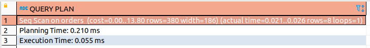
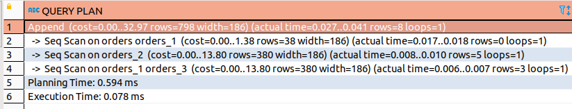

# Домашнее задание к занятию "6.4. PostgreSQL"

## Задача 1

Используя docker поднимите инстанс PostgreSQL (версию 13). Данные БД сохраните в volume.

Подключитесь к БД PostgreSQL используя `psql`.

Воспользуйтесь командой `\?` для вывода подсказки по имеющимся в `psql` управляющим командам.

**Найдите и приведите** управляющие команды для:
- вывода списка БД
- подключения к БД
- вывода списка таблиц
- вывода описания содержимого таблиц
- выхода из psql
---
_Ответ:_

Подготавливаем файл `docker-compose.yaml`:
```
version: '2.5'

volumes:
  db_data_6_4: {}

services:

  postgres:
    image: postgres:13
    container_name: postgre_sql_6_4
    ports:
      - "0.0.0.0:5432:5432"
    volumes:
      - db_data_6_4:/var/lib/postgresql/data
    environment:
      POSTGRES_USER: "pg-admin"
      POSTGRES_PASSWORD: "pg-pass"
      POSTGRES_DB: "postgres"
    restart: always
```
Выполняем сборку и запуск контейнера:  
`docker-compose up -d`  
Подключаемся к контейнеру и запускаем консольную утилиту psql в которой выводим список баз данных:  
`docker exec -it postgre_sql_6_4 psql -U pg-admin postgres`
Команды:  
- вывода списка БД - `\l[+]   [PATTERN]   list databases`
- подключения к БД - `\c[onnect] {[DBNAME|- USER|- HOST|- PORT|-] | conninfo}
                         connect to new database (currently "postgres")`
- вывода списка таблиц - `\dt[S+] [PATTERN]  list tables`
- вывода описания содержимого таблиц - `\d[S+]  NAME describe table, view, sequence, or index`
- выхода из psql - `\q quit psql`

---

## Задача 2

Используя `psql` создайте БД `test_database`.
```
CREATE DATABASE test_database;
```

Изучите [бэкап БД](https://github.com/netology-code/virt-homeworks/tree/master/06-db-04-postgresql/test_data).

Восстановите бэкап БД в `test_database`.

Запускаем восстановление данных предварительно создав роль которая есть в дампе:
```
vagrant@vm-docker:~/dz_6_4$ echo "CREATE USER "postgres" WITH PASSWORD 'pass123';" | docker exec -i postgre_sql_6_4 psql -Upg-admin -d test_database
CREATE ROLE
vagrant@vm-docker:~/dz_6_4$ cat test_dump.sql | docker exec -i postgre_sql_6_4 psql -Upg-admin -d test_database
SET
SET
SET
SET
SET
 set_config 
------------
 
(1 row)

SET
SET
SET
SET
SET
SET
CREATE TABLE
ALTER TABLE
CREATE SEQUENCE
ALTER TABLE
ALTER SEQUENCE
ALTER TABLE
COPY 8
 setval 
--------
      8
(1 row)

ALTER TABLE
```
Перейдите в управляющую консоль `psql` внутри контейнера.
```
docker exec -it postgre_sql_6_4 psql -U pg-admin postgres
```
Подключитесь к восстановленной БД и проведите операцию ANALYZE для сбора статистики по таблице.
```
postgres=# \c test_database 
You are now connected to database "test_database" as user "pg-admin".

test_database=# ANALYZE VERBOSE orders;
INFO:  analyzing "public.orders"
INFO:  "orders": scanned 1 of 1 pages, containing 8 live rows and 0 dead rows; 8 rows in sample, 8 estimated total rows
ANALYZE

```
Используя таблицу [pg_stats](https://postgrespro.ru/docs/postgresql/12/view-pg-stats), найдите столбец таблицы `orders` 
с наибольшим средним значением размера элементов в байтах.
```
test_database=# SELECT attname, avg_width FROM pg_stats WHERE tablename = 'orders' order by avg_width desc limit 1;
 attname | avg_width 
---------+-----------
 title   |        16
(1 row)

```
**Приведите в ответе** команду, которую вы использовали для вычисления и полученный результат.

## Задача 3

Архитектор и администратор БД выяснили, что ваша таблица orders разрослась до невиданных размеров и
поиск по ней занимает долгое время. Вам, как успешному выпускнику курсов DevOps в нетологии предложили
провести разбиение таблицы на 2 (шардировать на orders_1 - price>499 и orders_2 - price<=499).

Предложите SQL-транзакцию для проведения данной операции.

Можно ли было изначально исключить "ручное" разбиение при проектировании таблицы orders?

---

_Ответ:_  
Смотрим как выполняется запрос  до изменений:

1. Создаем функцию:  
```postgresql
CREATE OR REPLACE FUNCTION orders_insert_tg() RETURNS TRIGGER AS $$
DECLARE partition_table_name text;
BEGIN
  if new.price < 500 then
      partition_table_name = 'orders_2';
      IF (TO_REGCLASS(partition_table_name) IS NULL) THEN
        EXECUTE FORMAT(
            'CREATE TABLE %I ('
            '  CHECK (price < 500)'
            ') INHERITS (orders);'
            , partition_table_name);
      end if;
  else
      partition_table_name = 'orders_1';
      IF (TO_REGCLASS(partition_table_name) IS NULL) THEN
        EXECUTE FORMAT(
            'CREATE TABLE %I ('
            '  CHECK (price >= 500)'
            ') INHERITS (orders);'
            , partition_table_name);
      end if;
  end if;
  EXECUTE FORMAT('INSERT INTO %I VALUES ($1.*)', partition_table_name) USING NEW;
  RETURN NULL;
END; $$ LANGUAGE plpgsql;
```
2. Вешаем триггер на таблицу `orders` :
```postgresql
CREATE TRIGGER orders_insert_tg
BEFORE insert ON orders
FOR EACH ROW EXECUTE FUNCTION orders_insert_tg();
```
3. Разносим данные по таблицам:
```postgresql
WITH cte AS (  
    DELETE FROM ONLY orders RETURNING *)
INSERT INTO orders   
SELECT * FROM cte;
```
После преобразования план выглядит следующим образом:  


"Ручное" разбиение таблицы orders можно было избежать если бы функция и триггер были бы созданы при создании базы.

---
## Задача 4

Используя утилиту `pg_dump` создайте бекап БД `test_database`.

Как бы вы доработали бэкап-файл, чтобы добавить уникальность значения столбца `title` для таблиц `test_database`?

---

### Как cдавать задание

Выполненное домашнее задание пришлите ссылкой на .md-файл в вашем репозитории.

---
